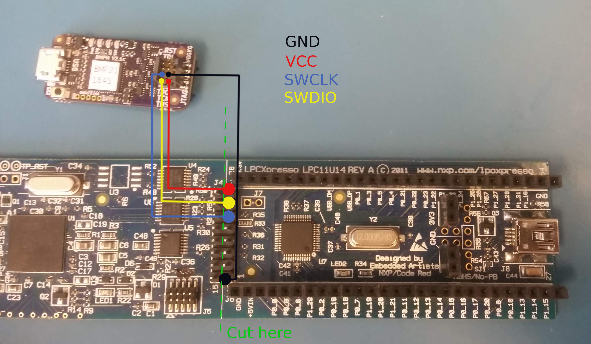
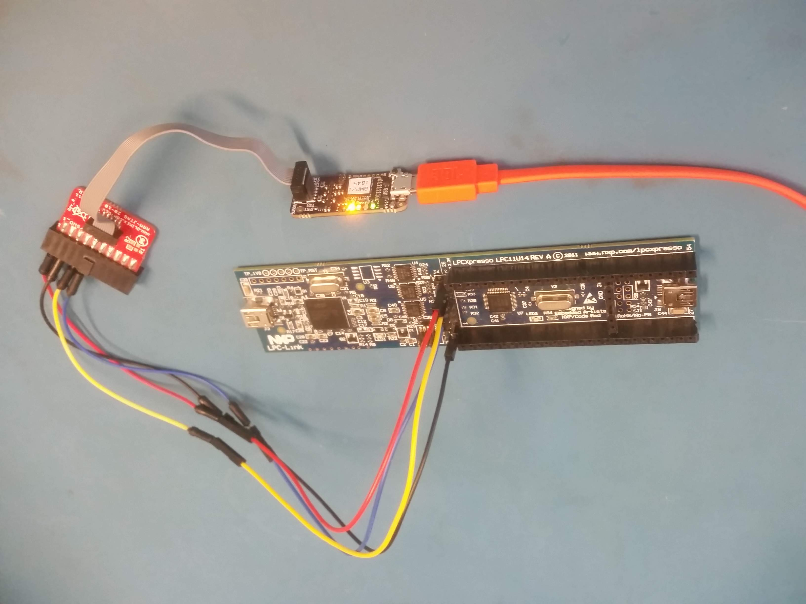
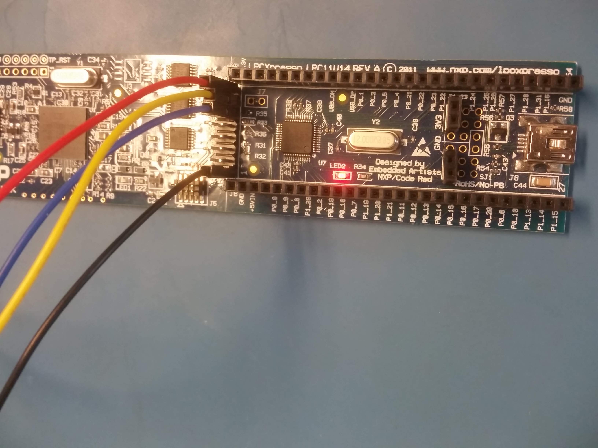

# Getting Started

This guide helps you setup and test your development board and tools.

## Connecting the wires



The way to connect depends on the board. For now, we assume the LPCXpresso board (see picture). This is a development board with a built-in NXP LPC-Link debugger. We are not going to use that here, so we have to make some changes to work with the Black Magic Probe:

1. We need to cut/remove the connection from the LPC11uxx side of the board to the NXP LPC-Link side of the board.
  This is done by cutting or de-soldering the jumper traces along along the green dotted line *before* soldering the header.

2. This board does not have a standard 10-pin jtag connector, so we connect via an [Olimex ARM-JTAG-20-10 adapter](https://www.olimex.com/Products/ARM/JTAG/ARM-JTAG-20-10/) and some jumper wires.
The following color coding is used in the pictures:
    * red: Power (3.3V)
    * yellow: SWDIO
    * blue: SWCLK
    * black: GND




## Testing Your Setup

Depending on your platform, a 'file' in /dev/ is created when you plugin the Black Magic Probe.

The name of this file can change sometimes, but it is relatively easy to find out by plugging the Black Magic Probe in and out and observing the differences.

* Linux: the file will be something like `/dev/ttyACM0`.

  Depending on the linux distribution, you may need permissions to use the debugger. On Ubuntu, this can be fixed by adding yourself to the `dialout` group. Don't forget to logout and login for the changes to take effect.
  ```
  sudo adduser <your-username> dialout
  ```
* Mac: the file will be formatted like `/dev/cu.usbmodemXXXXXXX1` (hint: you can find it with `ls /dev/cu.usbmodem*1`)

You can test if the Black Magic Probe correctly detects the board:

```
arm-none-eabi-gdb -nx --batch \
-ex 'target extended-remote /dev/ttyACM0' \
-ex 'monitor swdp_scan'
```
This should result in something like this:
```
Target voltage: 3.3V
Available Targets:
No. Att Driver
 1      LPC11xx
```
If the command above failed, make sure your target board has power. A nice feature of the official Black Magic Probe is that it can provide 3.3V to the target board. So if your board is compatible with 3.3V, try this (note the 'monitor tpwr enable' line):
```
arm-none-eabi-gdb -nx --batch \
-ex 'target extended-remote /dev/ttyACM0' \
-ex 'monitor tpwr enable' \
-ex 'monitor swdp_scan'
```


## Blinking the LED

Download the [pre-compiled blinky program *blinky.elf*](https://github.com/blinky101/blinky_lpc11uxx/tree/master/bare-metal/blinky.elf) (or you can [clone](https://github.com/blinky101/blinky_lpc11uxx) the repository and build it yourself)

The blinky progam can be flashed using this command, replacing /dev/ttyACM0 with the correct file for your setup:
```
arm-none-eabi-gdb -nx --batch \
-ex 'target extended-remote /dev/ttyACM0' \
-ex 'monitor swdp_scan' \
-ex 'attach 1' \
-ex 'load' \
-ex 'set mem inaccessible-by-default off' \
-ex 'set {int}0x40048000 = 2' \
-ex 'compare-sections' \
-ex 'kill' \
blinky.elf
```

The output will look similar to this:
```
Loading section .text, size 0x184 lma 0x0
Start address 0xd4, load size 388
Transfer rate: 3 KB/sec, 388 bytes/write.
Section .text, range 0x0 -- 0x184: matched.
Kill the program being debugged? (y or n) [answered Y; input not from terminal]

```

If all goes well, you have succesfully uploaded your first program!
You should now see a blinking LED (assuming your board has an LED attached to pin PI0_7).



