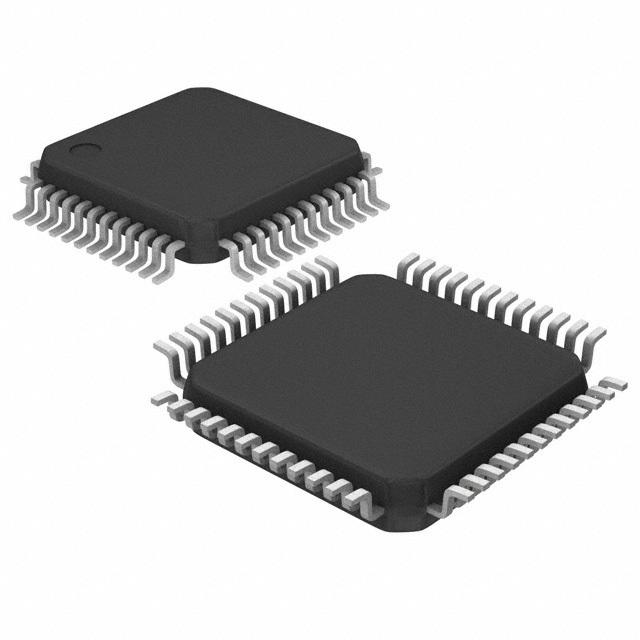

# LPC11uxx series



The LPC11uxx microcontrollers are entry-level 32 bit cortex-m0 microcontrollers with integrated support for USB. A 32-bit cortex-M0 clocked at up to 50MHz is a nice step up from the traditional 8-bit microcontrollers, but as an entry-level chip it is still very accessible for beginners: it is low cost and there are not too many peripherals to setup.

The purpose of this guide is to document the steps required to get started on this platform from scratch, using just a few open-source tools.

## What do you need

* A PCB with an LPC11uxx microcontroller, an LED and a JTAG/SWD connector. You can build one yourself, but if you want to get started quickly, we recommend getting a development board such as the [LPCXpresso board](https://www.nxp.com/support/developer-resources/software-development-tools/lpc-developer-resources-/lpc-microcontroller-utilities/lpcxpresso-board-for-lpc11u24:OM13066) 


* Debugging hardware to get your code on the microcontroller. We advise the [Black Magic Probe](https://github.com/blacksphere/blackmagic/wiki), as it is easy to work with and requires no software dependencies (just gdb). The Black Magic Probe itself is open source, sou you could build one yourself if you wanted to.

* A computer with some free USB ports. This guide assumes you are running linux or MacOS.

* [Gnu Arm Embedded Toolchain](https://developer.arm.com/open-source/gnu-toolchain/gnu-rm/downloads): this is a set of open-source tools including the gcc compiler and gdb debugger, specialized for embedded Arm cortex processors.

## Getting started: bare-metal

This repository contains three different blinky projects. The bare-metal project has the least dependencies and is very easy to get up and running. The downside is that the source code is a bit cryptic, especially if you are not used to embedded c code.

### Compile the firmware
```
git clone https://github.com/blinky101/blinky_lpc11uxx.git
cd blinky_lpc11uxx/bare-metal
make all
```

Or in case you don't want to compile the project or it doesn't work for you, you can download the [pre-compiled binary](https://github.com/blinky101/blinky_lpc11uxx/tree/master/bare-metal/blinky.bin) and [elf file](https://github.com/blinky101/blinky_lpc11uxx/tree/master/bare-metal/blinky.elf) directly.

### Flash it using a Black Magic Probe

The Black Magic probe acts as a remote gdb target, so we can flash the firmware directly using gdb.

Remark: you need to install the [Gnu Arm Embedded Toolchain](https://developer.arm.com/open-source/gnu-toolchain/gnu-rm/downloads). If the `arm-none-eabi-gdb` command is not available, you need to add the toolchain to your PATH. For example, add this line to ~/.bashrc (assuming linux):
```
export PATH=$PATH:/folder/where/you/installed/the/toolchain/gcc-arm-none-eabi-7-2017-q4-major/bin/
```

#### Connecting the Black Magic Probe

Depending on your platform, a 'file' in /dev/ is created when you plugin the Black Magic Probe.

The name of this file can change sometimes, but it is relatively easy to find out by plugging the Black Magic Probe in and out and observing the differences.

* Linux: the file will be something like `/dev/ttyACM0`.
  
  Depending on the linux distribution, you may need permissions to use the debugger. On Ubuntu, this can be fixed by adding yourself to the `dialout` group:
  ```
  sudo adduser <your-username> dialout
  ```
  
* Mac: the file will be formatted like `/dev/cu.usbmodem<serialnumber>`


The firmware can be flashed using this command, replacing /dev/ttyACM0 with the correct file as explained above:
```
arm-none-eabi-gdb -nx --batch \
-ex 'target extended-remote /dev/ttyACM0' \
-ex 'monitor swdp_scan' \
-ex 'attach 1' \
-ex 'load' \
-ex 'set mem inaccessible-by-default off' \
-ex 'set {int}0x40048000 = 2' \
-ex 'compare-sections' \
-ex 'kill' \
blinky.elf
```
If all goes well, you now have succesfully uploaded your first program!
Assuming your board has a LED on pin PI0_7, you should see that LED blinking.

### Debugging

The Black Magic Probe is not just for flashing the firmware, you can also step through the code:
```
arm-none-eabi-gdb -nx --batch \
-ex 'target extended-remote /dev/ttyACM0' \
-ex 'monitor swdp_scan' \
-ex 'attach 1' \
-ex 'set mem inaccessible-by-default off' \
blinky.elf
```
This should drop you in a gdb console, showing the code that is currently executing. Some helpful commands:
* continue (continues running the program)
* Ctrl-C (halts the program)
* step (step through the code line-by-line)
* ... and many more, see the gdb documentation

This can be very helpful to find bugs in your code, or to verify that the program is indeed running (in case your board does not have a LED to blink).

